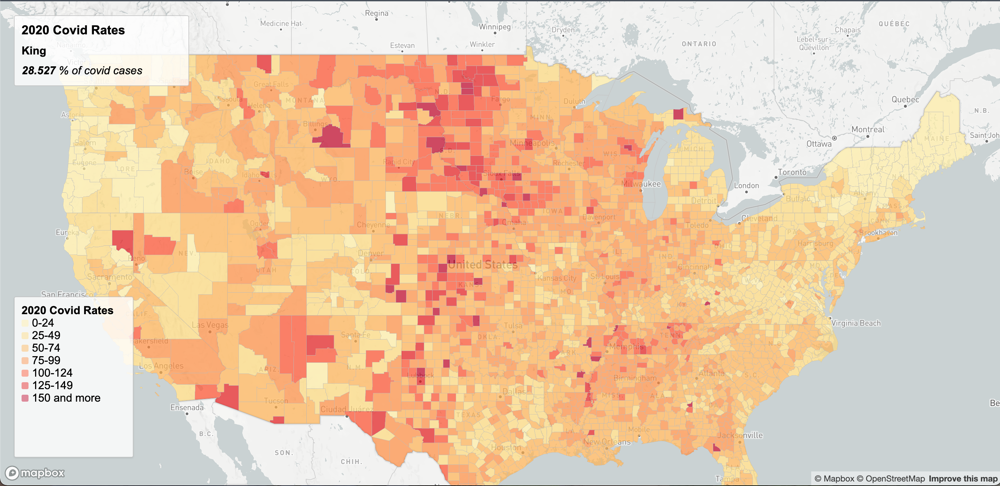

# Covid Cases and Rates 2020 in the US

## Intro
This project is looking at the covid rates and number of cases in the UNited States for 2020, the start of the pandemic. The data for both maps look at state as well as county data. The first map you will see is a choropleth map showing the rates of covid-19 in 2020. The lighter the color, the less precentage of people in that location had covid and vise versa for the darker colors. The second map is a proportional map of the number of cases for each location. The bigger the circle the more cases that location had, the smaller the circle the less cases.
## Links and Screenshots

[Access the proportional map](https://ilee17.github.io/webMap/map2.html) 
[Access the choropleth map](https://ilee17.github.io/webMap/map1.html)
## Functions
- mapbox
- map.on
## Sources
- Creating geojson files [mapshaper](https://mapshaper.org/)
- The U.S. county boundary shapefile was downloaded from [the U.S. Census Bureau](https://www.census.gov/geographies/mapping-files/time-series/geo/carto-boundary-file.html).
- The COVID-19 case/death data [The New York Times](https://github.com/nytimes/covid-19-data/blob/43d32dde2f87bd4dafbb7d23f5d9e878124018b8/live/us-counties.csv)
- The population data used for calculating the case rates are from the [2018 ACS 5 year estimates](https://data.census.gov/cedsci/table?g=0100000US.050000&d=ACS%205-Year%20Estimates%20Data%20Profiles&tid=ACSDP5Y2018.DP05&hidePreview=true)